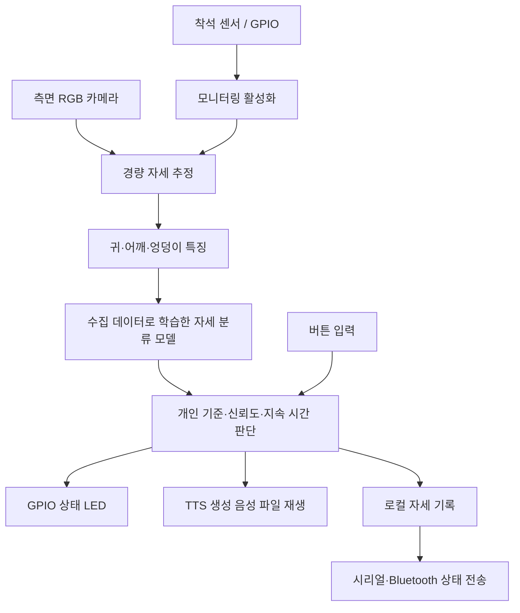

# Jetson Posture Coach

Jetson Nano 4GB와 카메라를 활용하는 **개인화 자세 감지·음성 피드백 IoT 시스템** 연구 프로젝트입니다.

> 현재 단계: 연구 기획 및 문헌 조사. 이 저장소에는 발표 자료와 자료 생성 스크립트가 있으며, 실제 장치 제어·AI 학습·추론 프로그램은 아직 구현하지 않았습니다. RAM·FPS·정확도·피드백 효과는 실측 전입니다.

## 연구 목표

컴퓨터 작업 중 전방머리자세와 상체 기울어짐을 감지하고, 개인별 기준과 자세 지속 시간을 반영해 불필요한 알림을 줄이는 시스템을 개발합니다. 자세 변화 인지와 교정 행동을 지원하는 연구이며, 임상 진단 또는 치료 효과를 주장하지 않습니다.

**연구 질문:** 4GB 장치에서 개인별 기준과 시간 조건을 반영하면 감지 성능을 유지하면서 고정 기준 방식보다 오경보를 줄일 수 있는가?

## 시스템 구성안



- **학습용 PC:** 데이터 라벨링, 작은 자세 분류 모델 학습, 모델 변환.
- **Jetson Nano 4GB:** 카메라 추론, 센서·버튼·LED, 음성 재생, 로컬 기록과 통신.
- **독립 운용 목표:** 배포 이후 PC 연결 없이 전원 투입 시 자동 실행.
- **음성 안내:** 먼저 PC에서 TTS로 생성한 한국어 파일을 재생합니다. 장치에서의 실시간 TTS 합성은 후속 검토 범위입니다.
- **주변장치:** 카메라, 착석 센서, LED·저항, 버튼, USB 오디오 출력, 호환 통신 모듈. 부품과 배선은 미확정이며 GPIO 전압과 스마트폰 호환성을 확인한 후 선정합니다.

Jetson Nano와 Jetson Orin Nano는 다른 장치입니다. 본 프로젝트는 기존 Nano 4GB를 대상으로 하며 JetPack 4 계열 호환성을 고려합니다.

## 교과목과의 연결

| 학습 내용 | 계획한 실습 |
| --- | --- |
| Linux·Python | 카메라·추론·음성·기록 통합 및 자동 실행 |
| IoT 데이터 수집·AI 학습 | 직접 수집한 자세 특징으로 분류 모델 학습 |
| GPIO·디지털 입출력 | 착석 감지와 상태 LED |
| 인터럽트 입력 | 음소거·기준 재설정 버튼 |
| 시리얼·Bluetooth | 상태·알림 이력 스마트폰 전송 |
| 협업·발표 | CV / 임베디드 / 평가 / 기획 역할 분담 |

## 개발 단계

- [x] 연구 주제, 논문 3편, 배경·시장 조사
- [x] 연구 초록과 17쪽 발표 자료
- [ ] 보드·카메라·오디오 동작 확인 (카메라 확인 완료, 오디오 남음 — [기록](docs/hardware_notes.md))
- [ ] 카메라 → 자세 분류 → 음성 안내 최소 기능 구현
- [ ] 동의 기반 데이터 수집·라벨링 및 외부 PC 학습
- [ ] 개인 기준·신뢰도·시간 조건 비교
- [ ] 센서·LED·버튼 통합
- [ ] 시리얼·Bluetooth 및 기록 통합
- [ ] 전체 기능 동시 실행·장시간 검증

## 평가 계획

- 사용자 단위로 학습·검증·시험 데이터를 분리합니다.
- 고정 기준과 개인 기준, 즉시 알림과 지속 시간 조건을 비교합니다.
- Macro-F1, 재현율, 시간당 오경보, 판정 가능 비율을 측정합니다.
- FPS, 프레임 처리 지연 p95, OS를 포함한 최대 전체 RAM을 측정합니다.
- 초기 목표는 5–10 FPS, 최대 RAM 3.5GB 이하, 30분 이상 연속 실행입니다. **달성 결과가 아닌 설계 목표**입니다.
- 알림 유무에 따른 자세 복귀율, 이탈 지속 시간, 알림 피로도를 비교합니다.
- 귀–어깨 각도는 임상적 craniovertebral angle(CVA)와 구분합니다.

## 발표 자료

발표 자료는 2026-09-13 연구 기획 초안입니다. 이후 논의된 GPIO·통신·음성 기능을 포함한 최신 범위는 이 README를 기준으로 합니다. 학과·학번·이름·팀원은 입력란으로 남아 있습니다.

- [PowerPoint .ppt](자세교정_연구제안.ppt)
- [편집용 .pptx](자세교정_연구제안.pptx)
- [PDF](자세교정_연구제안.pdf)
- [논문 조사·발표 원고](논문조사_초록_발표원고.md)
- [연구 초록](연구초록.txt)

### 발표 자료 재생성

개발 PC에서 실행합니다. 아래 과정은 보드용 AI 프로그램 실행 방법이 아닙니다.

```bash
python3 -m venv .venv
source .venv/bin/activate
pip install -r requirements-docs.txt
python build_presentation.py
```

스크립트는 같은 폴더의 PPTX·발표 원고·초록을 덮어씁니다. PPT와 PDF는 LibreOffice로 별도 변환합니다. 한국어 표시에는 Noto Sans CJK KR 글꼴을 사용합니다.

```bash
libreoffice --headless --convert-to 'ppt:MS PowerPoint 97' --outdir . 자세교정_연구제안.pptx
libreoffice --headless --convert-to pdf --outdir . 자세교정_연구제안.ppt
```

## 관련 논문과 공식 자료

| 자료 | 역할 |
| --- | --- |
| [Lee et al., Applied Sciences 2023](https://doi.org/10.3390/app131910935) | 측면 영상 기반 목·상체 자세 분류 |
| [Lite-HRNet, CVPR 2021](https://openaccess.thecvf.com/content/CVPR2021/html/Yu_Lite-HRNet_A_Lightweight_High-Resolution_Network_CVPR_2021_paper.html) | 경량 자세 추정 후보 |
| [Lite Pose, CVPR 2022](https://openaccess.thecvf.com/content/CVPR2022/html/Wang_Lite_Pose_Efficient_Architecture_Design_for_2D_Human_Pose_Estimation_CVPR_2022_paper.html) | 엣지 모델 효율 비교 |
| [Jetson Nano 공식 사양](https://developer.nvidia.com/embedded/jetson-nano) | 대상 하드웨어 |
| [JetPack 4 최종 릴리스 공지](https://forums.developer.nvidia.com/t/announcing-end-of-life-for-nvidia-jetpack-4-with-the-release-of-jetpack-4-6-6/314300) | 소프트웨어 호환성 |

논문에 보고된 타 장치 성능은 본 프로젝트의 Nano 실측 결과가 아닙니다. 원본 논문과 사전학습 모델은 해당 권리자의 조건을 따릅니다.

## 데이터 관리

원본 사용자 영상은 기본적으로 저장·외부 전송하지 않는 운용을 목표로 합니다. 연구용 수집은 참여자 동의를 받아 별도로 수행하며, 원본 영상·개인 식별정보·인증정보는 공개 저장소에 포함하지 않습니다. 자세 기록도 개인별 행동 데이터이므로 로컬에서 관리합니다.
