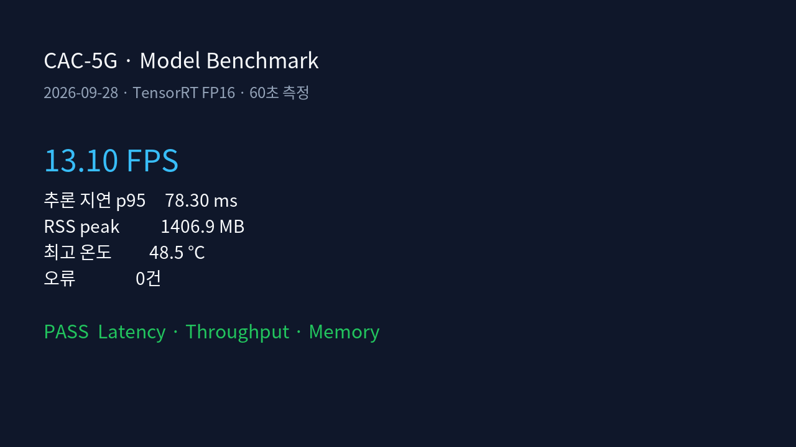
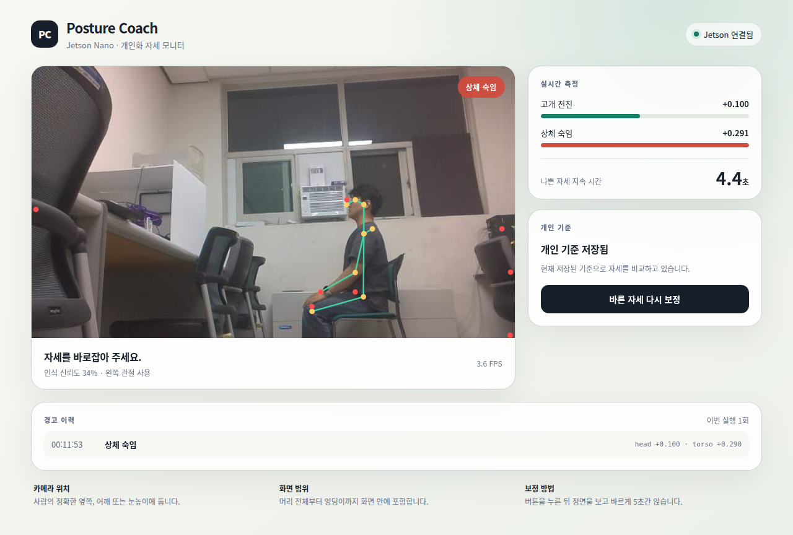
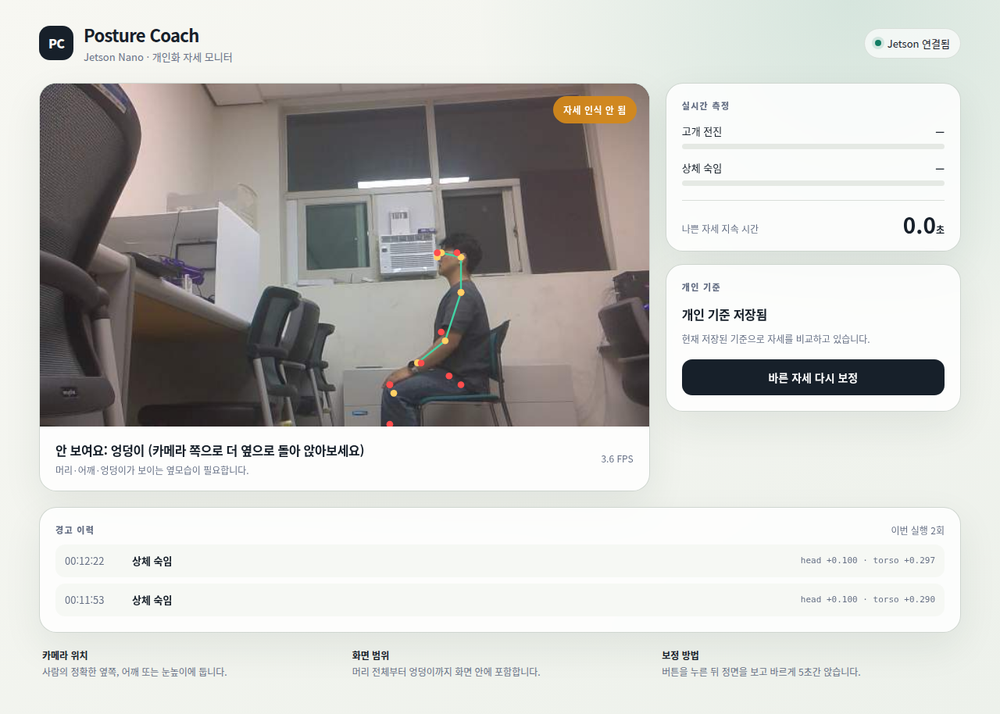
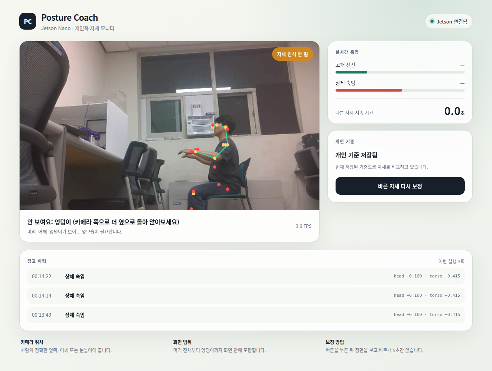
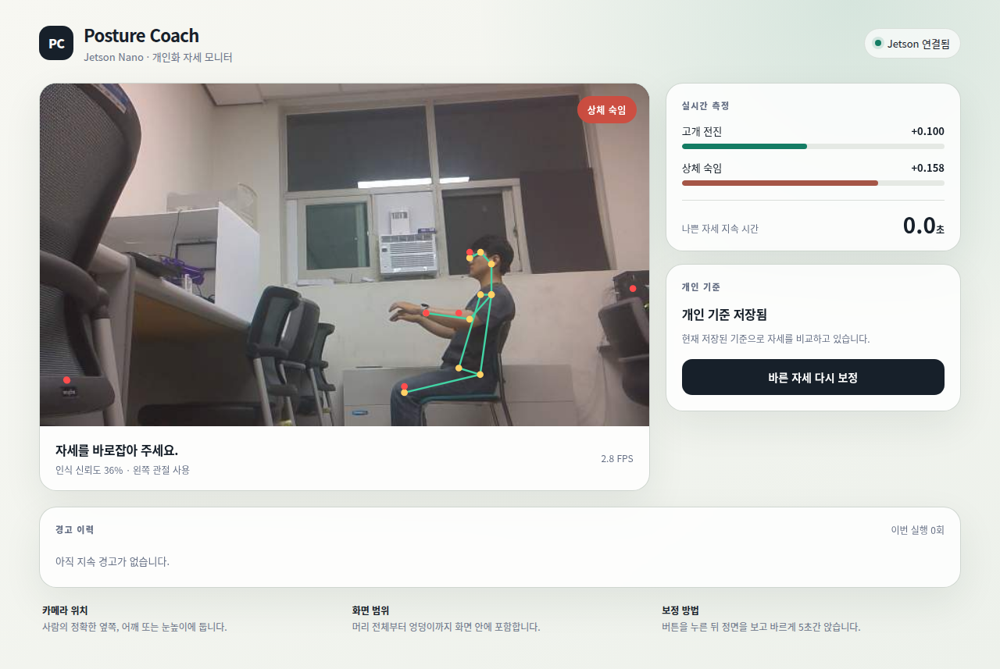
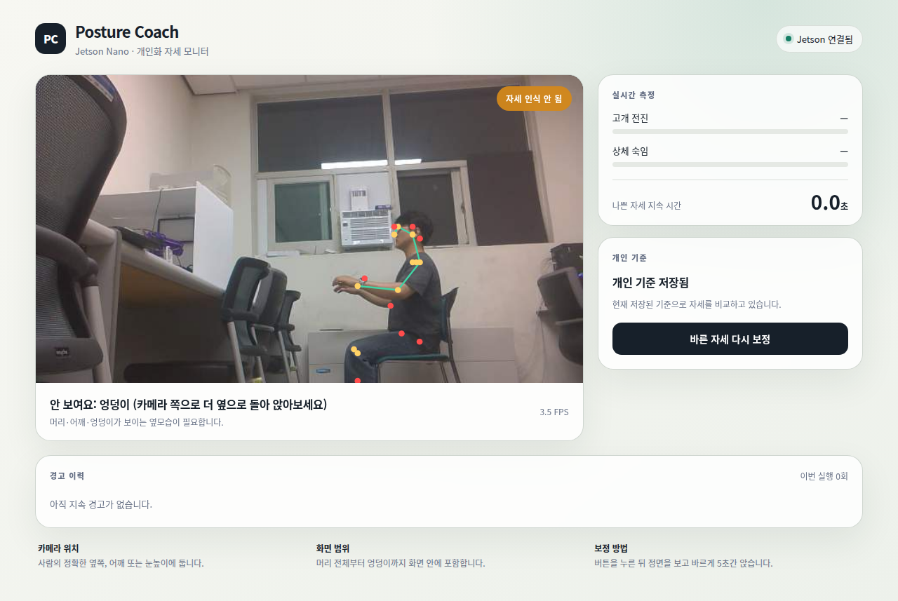
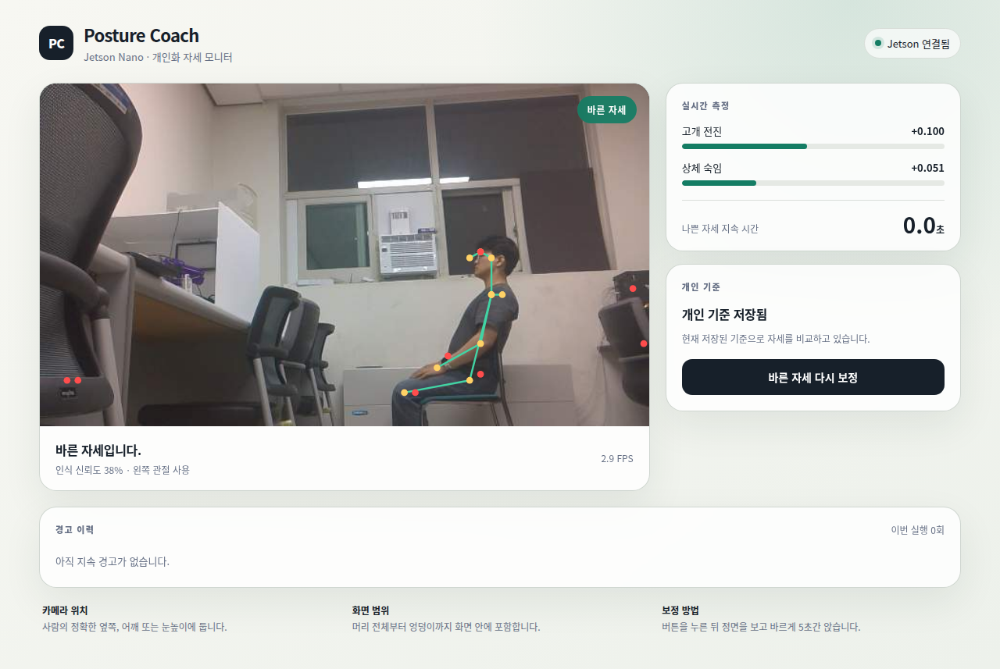
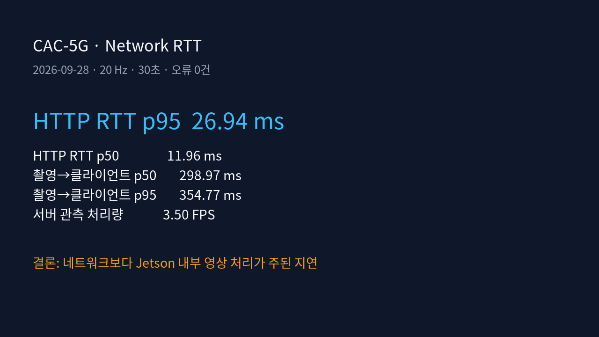

# CAC-5G 자세 인식 벤치마크 결과

- 측정일: 2026-09-28
- 장치: Jetson Nano 4GB
- 네트워크: `CAC-5G`, 5 GHz, 신호 -47 dBm, 링크 867 Mbit/s
- 모델: Pose-ResNet18 TensorRT FP16
- 자세 실험: 워밍업 5초 후 60초 측정
- 키포인트 유효 기준: confidence `>= 0.25`
- 동작 안내: 노트북 한국어 TTS

이 문서는 한 명을 조건별 한 번씩 측정한 탐색 실험 결과다. 조건 효과를 일반화하거나
통계적으로 확정하는 자료가 아니다.

## 실험 구성

| run ID | 손 위치 | 등받이 | 용도 |
| --- | --- | --- | --- |
| `20260928-001138-cac5g-tts-hands-on-thighs` | 허벅지 | 기대지 않음 | 손 위치 비교 A |
| `20260928-001336-cac5g-tts-hands-raised` | 가슴 높이 | 기대지 않음 | 손 위치 비교 B |
| `20260928-001529-cac5g-tts-backrest-leaning` | 가슴 높이 | 기대기 | 등받이 비교 A |
| `20260928-001728-cac5g-tts-backrest-clear` | 가슴 높이 | 기대지 않음 | 등받이 비교 B 및 반복 조건 |
| `20260928-002044-cac5g-tts-hands-thighs-backrest` | 허벅지 | 기대기 | 손·등받이 결합 조건 |

조건별 화면은 실제 손과 등 위치를 확인한 뒤 저장했다.

## 모델 단독 성능

TensorRT 엔진만 합성 프레임으로 측정한 결과다. 카메라·얼굴 검출·네트워크는 포함하지
않는다.

| 지표 | 결과 | 목표 | 판정 |
| --- | ---: | ---: | --- |
| 처리량 | 13.10 FPS | 5 FPS 이상 | PASS |
| 추론 지연 p95 | 78.30 ms | 200 ms 이하 | PASS |
| RSS peak | 1406.9 MB | 3500 MB 이하 | PASS |
| 최고 온도 | 48.5 °C | 80 °C 미만 | PASS |
| 오류 | 0건 | 0건 | PASS |

## 손 위치·등받이·엉덩이 인식

현재 카메라 쪽인 왼쪽 신체 연쇄가 주로 자세 계산에 사용됐다.

| 손 위치 | 등받이 | raw 유효 자세율 | 왼쪽 엉덩이 가시율 | 왼쪽 엉덩이 평균 confidence | 상태 전환/분 |
| --- | --- | ---: | ---: | ---: | ---: |
| 허벅지 | 기대지 않음 | 65.12% | 65.12% | 0.292 | 14.03 |
| 가슴 높이 | 기대지 않음, 1회차 | 86.05% | 86.05% | 0.295 | 6.01 |
| 가슴 높이 | 기대기 | 85.45% | 87.79% | 0.333 | 59.40 |
| 가슴 높이 | 기대지 않음, 2회차 | 28.77% | 28.77% | 0.251 | 11.03 |
| 허벅지 | 기대기 | 100.00% | 100.00% | 0.385 | 0.00 |

단순 비교에서는 손을 허벅지에서 들었을 때 첫 비기대 회차의 유효 자세율이
65.12%에서 86.05%로 20.93%p 상승했다. 그러나 동일한 명목 조건인 “손을 들고
등받이에 기대지 않기”를 다시 측정했을 때 28.77%까지 떨어졌다. 반복 조건 간 차이가
57.28%p이므로, 이번 한 번의 결과만으로 손을 드는 행위가 엉덩이 인식을 개선한다고
결론 내릴 수 없다.

등받이 비교도 마찬가지다. 손을 든 상태에서 기대기는 85.45%, 비기대 2회차는
28.77%였지만, 동일한 비기대 1회차는 86.05%였다. 손을 허벅지에 두고 기대었을 때는
100%가 나왔다. 즉 손이나 등받이의 단일 효과보다 사람이 좌석에서 몇 cm 이동했는지,
골반 윤곽이 좌판과 어떻게 겹쳤는지, 신체 회전각이 어땠는지가 결과를 크게 바꿨을
가능성이 높다.

이번 결과로 확실히 말할 수 있는 것은 현재 모델의 엉덩이 confidence가 조건 변화에
민감하고, 엉덩이 가시율이 raw 유효 자세율을 거의 직접 제한한다는 점이다. 인과효과를
확정하려면 바닥과 좌판에 위치 표시를 하고 조건 순서를 무작위화하여 각각 최소 3회
반복해야 한다.

## 조건별 스크린샷

### 손을 허벅지에 두고 등받이에 기대지 않음

### 손을 가슴 높이로 들고 등받이에 기대지 않음

### 손을 들고 등받이에 기대기

### 손을 들고 등받이에서 떨어짐

### 손을 허벅지에 두고 등받이에 기대기

## 엉덩이가 실제로 필요한가

### 현재 구현에서는 필수

`src/posture.py`의 `extract_metrics()`는 코와 한쪽 귀·어깨·엉덩이가 모두 confidence
0.25 이상일 때만 자세 특징을 만든다. 엉덩이는 다음에 사용된다.

1. `torso_forward = (어깨 x - 엉덩이 x) / 몸통 길이`의 기준점
2. 귀·어깨·엉덩이 변위를 사람 크기와 카메라 거리로 정규화하는 어깨-엉덩이 몸통 길이
3. 고개만 앞으로 나온 경우와 몸통 전체가 숙어진 경우의 분리
4. 서로 다른 사람의 관절이 합쳐지는 것을 거르는 신체 비율 검사
5. 개인 기준 자세의 `head_forward`와 `torso_forward` 보정

따라서 현재 알고리즘에서는 엉덩이를 얻지 못하면 `NO_POSE`가 되는 것이 의도된 안전
동작이다. 잘못된 골반 위치로 자세를 판정하는 것보다 판정을 보류해 오경보를 막는다.

### 자세 교정 시스템 전체에서 항상 필수인 것은 아님

연구 범위를 고개 전진만으로 줄이면 귀-어깨 상대 위치나 전용 분류 모델을 사용해
엉덩이 없이 구현할 수 있다. 다만 이 방식은 몸통 숙임과 고개 전진을 분리하기 어렵고,
카메라 거리·회전 변화에 민감해진다. 대안은 다음과 같다.

- 최근 유효 엉덩이를 짧은 시간 유지하는 temporal fallback
- 좌판 또는 등받이 위치를 골반 대리 기준점으로 사용
- 사람 segmentation과 전용 상체 분류 모델 사용
- 엉덩이 confidence가 낮을 때 머리 자세만 제한적으로 판정

현재 목표가 고개 전진과 상체 숙임을 함께 개인화 판정하는 것이므로, 엉덩이는 임상적
필수 관절이라기보다 현재 기하 기반 알고리즘의 핵심 기준점이다.

## 전체 파이프라인 성능과 네트워크 원인 분석

| 조건 | FPS | 전체 지연 p95 | 얼굴 검출 평균 | 추론 평균 |
| --- | ---: | ---: | ---: | ---: |
| 손 허벅지·비기대 | 3.575 | 319.50 ms | 200.84 ms | 69.16 ms |
| 손 들기·비기대 1 | 3.577 | 316.85 ms | 201.25 ms | 68.77 ms |
| 손 들기·기대 | 3.543 | 319.42 ms | 202.45 ms | 68.91 ms |
| 손 들기·비기대 2 | 3.527 | 322.11 ms | 204.78 ms | 68.88 ms |
| 손 허벅지·기대 | 3.560 | 320.39 ms | 201.12 ms | 68.88 ms |

조건이 달라도 FPS와 지연이 거의 같다. 얼굴 검출 약 201~205 ms와 TensorRT 추론 약
69 ms가 한 프레임 처리시간의 대부분을 차지한다. 이 구간은 Jetson 내부에서 실행되며
네트워크를 사용하지 않는다.

CAC-5G에서 HTTP RTT는 p50 11.96 ms, p95 26.94 ms였지만 촬영부터 클라이언트 최초
수신까지는 p50 298.97 ms, p95 354.77 ms였다. 네트워크 왕복보다 영상 처리 대기가
약 10배 이상 크므로 3.5 FPS의 주원인은 Wi-Fi가 아니라 Jetson 내부 처리량이다.

## 원본 결과

- [model summary](../benchmarks/runs/20260928-000954-cac5g-tts-model-model/summary.json)
- [손 허벅지·비기대 summary](../benchmarks/runs/20260928-001138-cac5g-tts-hands-on-thighs/summary.json)
- [손 들기·비기대 1 summary](../benchmarks/runs/20260928-001336-cac5g-tts-hands-raised/summary.json)
- [손 들기·기대 summary](../benchmarks/runs/20260928-001529-cac5g-tts-backrest-leaning/summary.json)
- [손 들기·비기대 2 summary](../benchmarks/runs/20260928-001728-cac5g-tts-backrest-clear/summary.json)
- [RTT summary](../benchmarks/runs/20260928-001943-cac5g-rtt-rtt/summary.json)
- [손 허벅지·기대 summary](../benchmarks/runs/20260928-002044-cac5g-tts-hands-thighs-backrest/summary.json)
- [전체 비교 CSV](../benchmarks/comparison.csv)
